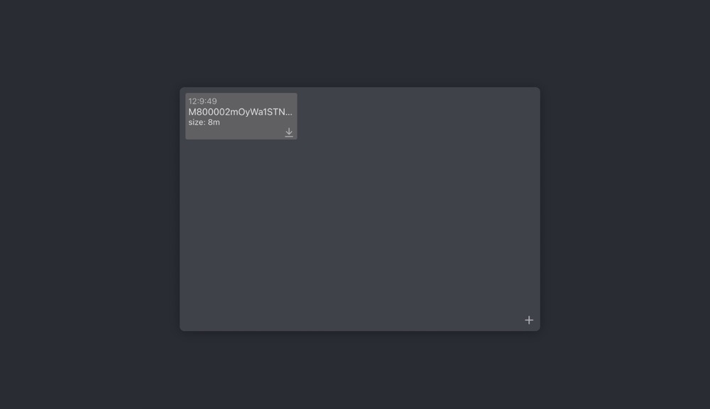
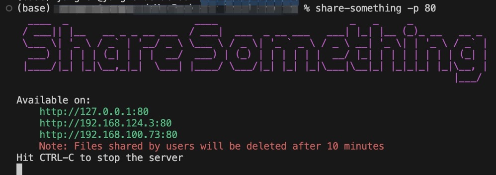

# Share Something

Share something between machines with different system in Local Area Network even Wide Area Network.

# Usage

## source code

### open a terminal and execute the following command:
```shell
git clone https://github.com/novenn/share-somethting

cd share-somethting

yarn serve
```

open your browser and tab http://ip:9527, you will see the page likes below:



## Global npm package
### open a terminal and execute the following command:
```shell
npm install share-someting -g

share-someting -p 9527 

# or in shorthand 
ss -port 9537
```
and then you will see the something likes below:



